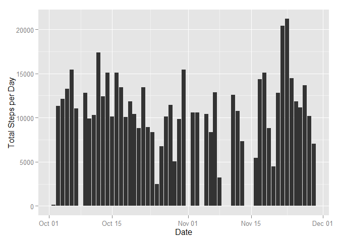
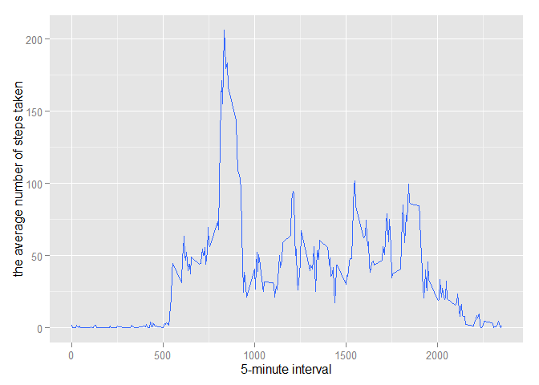
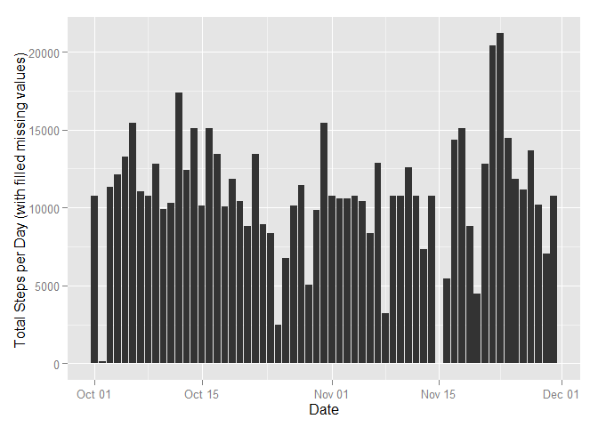
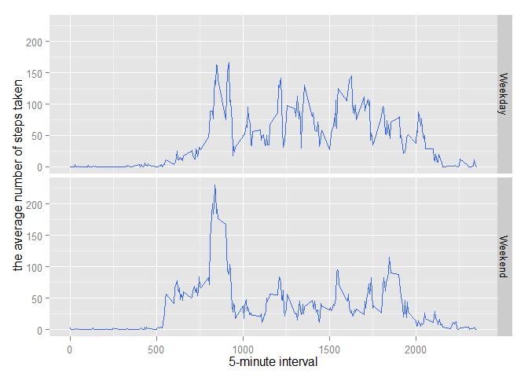

# Reproducible Research: Peer Assessment 1
Haidong Gu  
11, December, 2014  


## Step 1: Loading and preprocessing the data

load librarires

```r
library(ggplot2)
```

```
## Warning: package 'ggplot2' was built under R version 3.1.2
```


set working directory, it will be different for each person

```r
setwd("c:/haidong/github/RepData_PeerAssessment1")
getwd()
```

```
## [1] "c:/haidong/github/RepData_PeerAssessment1"
```

 1. Load the data (i.e. read.csv())


```r
csv_file <- "activity.csv"

if (!file.exists(csv_file)) {
    zip_file <- "activity.zip"
    if (!file.exists(zip_file)) {
        print("there is no data source for this project")
        q()
    }
    unzip(zip_file)
}

activity <- read.csv(csv_file)
```

 2. Process/transform the data (if necessary) into a format suitable for your analysis


```r
activity$date <- as.Date(activity$date,"%Y-%m-%d")
```

preview the data


```r
summary(activity)
```

```
##      steps             date               interval     
##  Min.   :  0.00   Min.   :2012-10-01   Min.   :   0.0  
##  1st Qu.:  0.00   1st Qu.:2012-10-16   1st Qu.: 588.8  
##  Median :  0.00   Median :2012-10-31   Median :1177.5  
##  Mean   : 37.38   Mean   :2012-10-31   Mean   :1177.5  
##  3rd Qu.: 12.00   3rd Qu.:2012-11-15   3rd Qu.:1766.2  
##  Max.   :806.00   Max.   :2012-11-30   Max.   :2355.0  
##  NA's   :2304
```

```r
head(activity)
```

```
##   steps       date interval
## 1    NA 2012-10-01        0
## 2    NA 2012-10-01        5
## 3    NA 2012-10-01       10
## 4    NA 2012-10-01       15
## 5    NA 2012-10-01       20
## 6    NA 2012-10-01       25
```

## Step 2 What is mean total number of steps taken per day?

 1. Make a histogram of the total number of steps taken each day

I will ignore missing values in the dataset

```r
activity_2 <- activity[complete.cases(activity),]
```

This is a histogram of the total number of steps taken each day, it is drawn with ggplot2


```r
graph_2 <- qplot(x=date, y=steps, data=activity_2, stat='summary', fun.y=sum, geom='histogram')
graph_2 <-  graph_2 + labs(y='Total Steps per Day', x='Date')
plot(graph_2)
```

 


 2. Calculate and report the mean and median total number of steps taken per day


```r
activity_daily_2 <- aggregate(formula=steps~date, data=activity_2, FUN=sum)
head(activity_daily_2)
```

```
##         date steps
## 1 2012-10-02   126
## 2 2012-10-03 11352
## 3 2012-10-04 12116
## 4 2012-10-05 13294
## 5 2012-10-06 15420
## 6 2012-10-07 11015
```

```r
mean_2 <- round(mean(activity_daily_2$steps), 0)
median_2 <- median(activity_daily_2$steps)
paste("mean per day is", mean_2)
```

```
## [1] "mean per day is 10766"
```

```r
paste("median per day is", median_2)
```

```
## [1] "median per day is 10765"
```


## Step 3: What is the average daily activity pattern?

I will ignore missing values in the dataset (same as Step 2)


```r
activity_3 <- activity[complete.cases(activity),]
```

 1. Make a time series plot (i.e. type = "l") of the 5-minute interval (x-axis) and the average number of steps taken, averaged across all days (y-axis). In qplot, smooth is same to type l time series plot.


```r
graph_3 <- qplot(x=interval, y=steps, data=activity_3, stat='summary', fun.y=mean, geom='smooth')
graph_3 <- graph_3 + labs(y='the average number of steps taken', x='5-minute interval')
plot(graph_3)
```

 

 2. Which 5-minute interval, on average across all the days in the dataset, contains the maximum number of steps?

```r
activity_interval_3 <- aggregate(formula=steps~interval, data=activity_3, FUN=mean)

max_3 <- activity_interval_3[which.max(activity_interval_3$steps),][1]
```

* interval 835 contains the maximum number of steps. 

## Step 4: Imputing missing values

 1. Calculate and report the total number of missing values in the dataset (i.e. the total number of rows with NAs)


```r
result_4 <- summary(complete.cases(activity))
missing_count_4 <- result_4["FALSE"]
result_4
```

```
##    Mode   FALSE    TRUE    NA's 
## logical    2304   15264       0
```

There are rows contains 2304 NA values (FALSE from summary).  

 2. Devise a strategy for filling in all of the missing values in the dataset. The strategy does not need to be sophisticated. For example, you could use the mean/median for that day, or the mean for that 5-minute interval, etc.

I will use mean value for the interval (not that day, there are somedays has all NA values for steps). "activity_interval_3" is the one we calculated in Step 3 for average steps per interval.
take a quick look at activity_interval_3

```r
summary(activity_interval_3)
```

```
##     interval          steps        
##  Min.   :   0.0   Min.   :  0.000  
##  1st Qu.: 588.8   1st Qu.:  2.486  
##  Median :1177.5   Median : 34.113  
##  Mean   :1177.5   Mean   : 37.383  
##  3rd Qu.:1766.2   3rd Qu.: 52.835  
##  Max.   :2355.0   Max.   :206.170
```

```r
head(activity_interval_3)
```

```
##   interval     steps
## 1        0 1.7169811
## 2        5 0.3396226
## 3       10 0.1320755
## 4       15 0.1509434
## 5       20 0.0754717
## 6       25 2.0943396
```

 3. Create a new dataset that is equal to the original dataset but with the missing data filled in.

merge the two data frame by interval, after merge, there will be column for steps (steps.x and steps.y), we will create a new step column with values from steps.x and step.y, and in the end, drop un-necessary columns.


```r
activity_4 <- merge( activity, activity_interval_3, by.x = "interval", by.y = "interval", all.x = TRUE)
activity_4$steps <- ifelse(is.na(activity_4$steps.x), activity_4$steps.y, activity_4$steps.x)

activity_4 <- activity_4[c('steps', 'date', 'interval')]
```

Take a look at the new data "activity_4", all "NA" are filled with the mean value by its interval as there is no more FALSE value from the summary(complete.cases(activity_4)).


```r
summary(complete.cases(activity_4))
```

```
##    Mode    TRUE    NA's 
## logical   17568       0
```

```r
head(activity_4)
```

```
##      steps       date interval
## 1 1.716981 2012-10-01        0
## 2 0.000000 2012-11-23        0
## 3 0.000000 2012-10-28        0
## 4 0.000000 2012-11-06        0
## 5 0.000000 2012-11-24        0
## 6 0.000000 2012-11-15        0
```

 4. Make a histogram of the total number of steps taken each day and Calculate and report the mean and median total number of steps taken per day. Do these values differ from the estimates from the first part of the assignment? What is the impact of imputing missing data on the estimates of the total daily number of steps?

This is the graph using the same method we have drawn for Step 2, but with new non missing value data frame. It is obvious that we have less days with empty values, and the overall shape are maintained. 


```r
graph_4 <- qplot(x=date, y=steps, data=activity_4, stat='summary', fun.y=sum, geom='histogram')
graph_4 <-  graph_4 + labs(y='Total Steps per Day (with filled missing values) ', x='Date')
plot(graph_4)
```

 


## Step 5: Are there differences in activity patterns between weekdays and weekends?

 1. Create a new factor variable in the dataset with two levels - "weekday" and "weekend" indicating whether a given date is a weekday or weekend day.

subset the data, note that I am using "activity_4", instead of "activity". "activity_4" is the one filling with missing values from Step 4.


```r
activity_5 <- activity_4
activity_5$weekday <- tolower(weekdays(activity_5$date))
activity_5$week <- ifelse((activity_5$weekday == "sunday" | activity_5$weekday == "saturday"), "Weekday", "Weekend")
activity_5 <- activity_5[c('steps','date','interval', 'week')]
```

take a look of the data

```r
summary(activity_5)
```

```
##      steps             date               interval          week          
##  Min.   :  0.00   Min.   :2012-10-01   Min.   :   0.0   Length:17568      
##  1st Qu.:  0.00   1st Qu.:2012-10-16   1st Qu.: 588.8   Class :character  
##  Median :  0.00   Median :2012-10-31   Median :1177.5   Mode  :character  
##  Mean   : 37.38   Mean   :2012-10-31   Mean   :1177.5                     
##  3rd Qu.: 27.00   3rd Qu.:2012-11-15   3rd Qu.:1766.2                     
##  Max.   :806.00   Max.   :2012-11-30   Max.   :2355.0
```

```r
head(activity_5)
```

```
##      steps       date interval    week
## 1 1.716981 2012-10-01        0 Weekend
## 2 0.000000 2012-11-23        0 Weekend
## 3 0.000000 2012-10-28        0 Weekday
## 4 0.000000 2012-11-06        0 Weekend
## 5 0.000000 2012-11-24        0 Weekday
## 6 0.000000 2012-11-15        0 Weekend
```

 2. Make a panel plot containing a time series plot (i.e. type = "l") of the 5-minute interval (x-axis) and the average number of steps taken, averaged across all weekday days or weekend days (y-axis). See the README file in the GitHub repository to see an example of what this plot should look like using simulated data.


```r
graph_5 <- qplot(x=interval, y=steps, data=activity_5, stat='summary', fun.y=mean, geom='smooth')
graph_5 <-  graph_5 + labs(y='the average number of steps taken', x='5-minute interval')
graph_5 <- graph_5 + facet_grid(week~.)
plot(graph_5)
```

 


## System Setup

```r
sessionInfo()
```

```
## R version 3.1.1 (2014-07-10)
## Platform: x86_64-w64-mingw32/x64 (64-bit)
## 
## locale:
## [1] LC_COLLATE=English_United States.1252 
## [2] LC_CTYPE=English_United States.1252   
## [3] LC_MONETARY=English_United States.1252
## [4] LC_NUMERIC=C                          
## [5] LC_TIME=English_United States.1252    
## 
## attached base packages:
## [1] stats     graphics  grDevices utils     datasets  methods   base     
## 
## other attached packages:
## [1] ggplot2_1.0.0
## 
## loaded via a namespace (and not attached):
##  [1] colorspace_1.2-4 digest_0.6.4     evaluate_0.5.5   formatR_1.0     
##  [5] grid_3.1.1       gtable_0.1.2     htmltools_0.2.6  knitr_1.8       
##  [9] labeling_0.3     MASS_7.3-33      munsell_0.4.2    plyr_1.8.1      
## [13] proto_0.3-10     Rcpp_0.11.3      reshape2_1.4     rmarkdown_0.2.68
## [17] scales_0.2.4     stringr_0.6.2    tools_3.1.1      yaml_2.1.13
```
